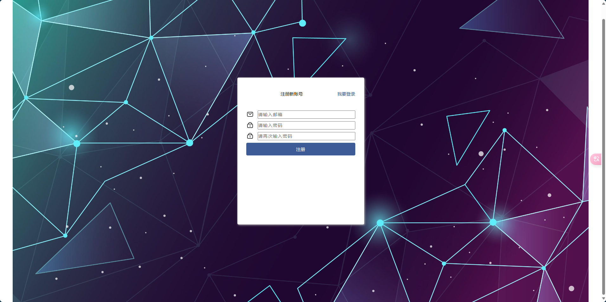

# Car Rental Management System (Partly Completed)
[中文版](README-ch.md)
# Overview
The platform is built using a B/S architecture and developed with .NET 8.

The entire platform includes both frontend and backend sections.

Frontend features include: Homepage, Vehicle Details, Vehicle Reservation, and User Center.

Backend features include: Vehicle Management, Category Management, Tag Management, Comment Management, User Management, Operations Management, Log Management, Statistics, and System Information.
# Target Audience
College students

System designers

Course projects

Graduation design
# Admin Account:
Username: admin

Password: admin123


# Screenshots





# Deployment and Running Instructions
- Install .NET 8.0
Link: https://dotnet.microsoft.com/en-us/download

- Download Packages: 
Run the following command in the project directory to restore the required NuGet packages:
```
dotnet restore
```
- Run the Project: Navigate to the CarRental directory and run:
```
dotnet run
```