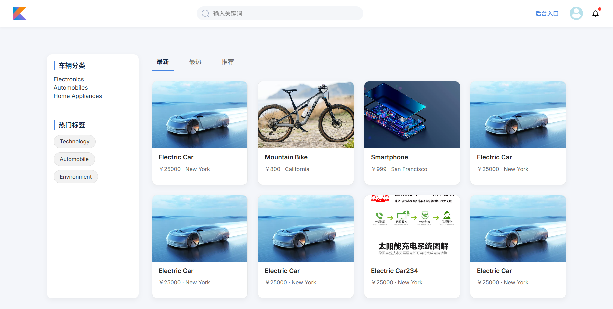

# 车辆租赁管理平台/租车系统(partly completed)
[English Version](README-en.md)
### 功能介绍
平台采用 B/S 结构，使用 .NET9 开发


整个平台包括前台和后台两个部分。

前台功能包括：首页、车辆详情、车辆预订、用户中心模块。

后台功能包括：车辆管理、分类管理、标签管理、评论管理、用户管理、运营管理、日志管理、统计分析、系统信息模块。

### 适合人群
大学生、系统设计人员、课程作业、毕业设计

### 帐号：
用户名：admin

密码：admin123

### 效果图



### 部署运行

- 安装.Net9.0，链接：https://dotnet.microsoft.com/en-us/download

- 下载包
```cs
dotnet restore
```

- 运行项目，在项目文件夹`CarRental`下,运行
```cs
dotnet run
```

### 数据库
数据库存在本地的 carDB.db，有可能变得很大，如果要初始化，那么直接删除即可，`dotnet run`之后会自动生成一个新的
